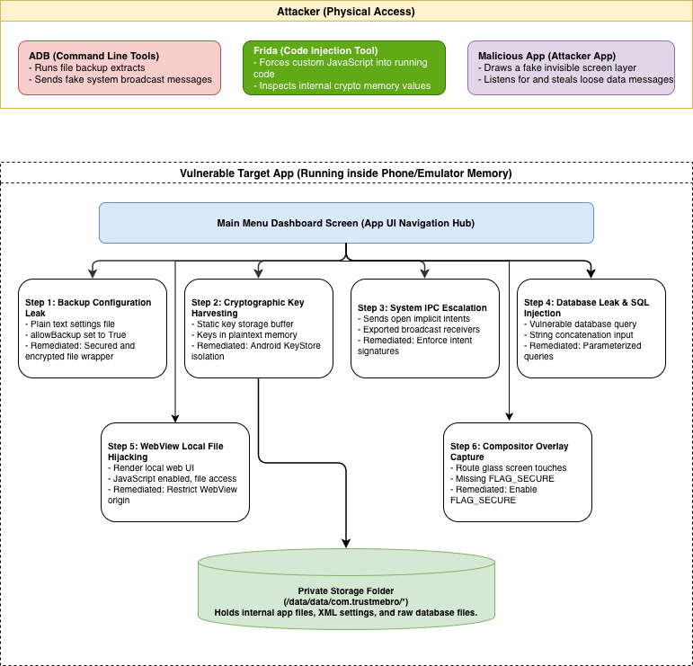
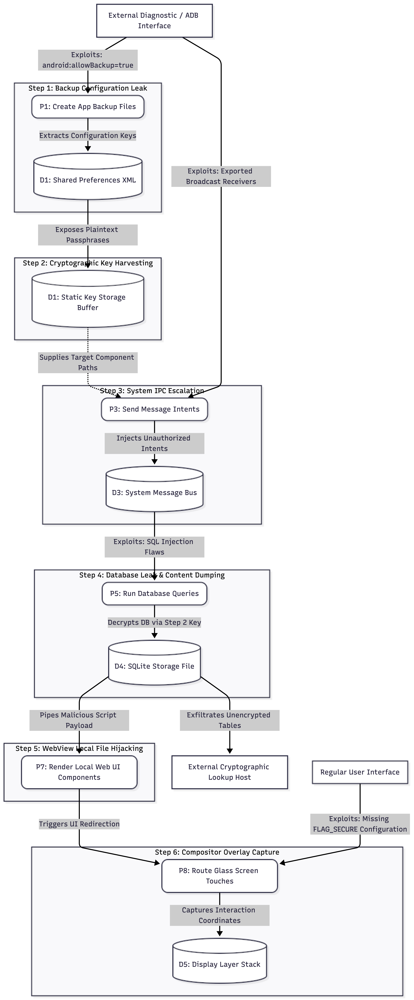

# TrustMeBro

# Architecture diagram

# Flow diagram

# Implementation plan

## Phase 1: Project initialization & infrastructure

Setting-up the development environment and version control standards.

1. Repository initialization and access control.
2. Project structure - creating a multi-module Android Studio project using Gradle.
    1. app - Main UI and navigation hub.
    2. core - shared crypto, storage and networking interfaces.
    3. vulnerabilities - the logic of the 6 steps shown in the diagram.
3. Static analysis integration - configuring `detekt` for Kotlin linting and `android lint` for resource/manifest checks.
4. CI/CD pipeline - setting-up Github Actions or GitLab CI to run `./gradlew lint` and `test` on every PR.

## Phase 2: Core module implementation (vulnerable state)

Each step will be implemented in its "Vulnerable" state to allow for security testing.

1. Backup Configuration Leak
    1. Configuring `AndroidManifest.xml` with `android:allowBackup="true"`.
    2. Storing sensitive settings in a plain-text XML file in `/data/data/com.trustmebro/shared_prefs/`.
2. Cryptographic Key Harvesting
    1. Storing encryption keys in static memory buffers.
    2. Loading keys directly into plaintext variables without Android KeyStore isolation.
3. System IPC Escalation
    1. Creating exported BroadcastReceiver components without signature protection.
    2. Defining implicit Intent filters for sensitive data transfer.
    3. Allowing unauthorized intents to trigger sensitive operations.
4. Database Leak & Content Dumping
    1. Implementing a local database using `SQLiteOpenHelper`.
    2. Adding string concatenation for database queries to permit SQL Injection (SQLi).
    3. Exposing unencrypted database tables.
5. WebView Local File Hijacking
    1. Enabling JavaScript in WebView components.
    2. Allowing file access in WebView settings.
    3. Loading local HTML with potential for script injection.
6. Compositor Overlay Capture
    1. Rendering UI without `FLAG_SECURE` configuration.
    2. Allowing overlapping views and hidden touch events.
    3. Not filtering touches when application is obscured.
7. QA & code review - during the component implementation
    1. Feature branching
    2. PR checks - successful builds, passing linter
    3. Unit testing
    4. Manual verification using the attacker tools

## Phase 3: Attacker tooling & validation

Developing the "attacker" suite described in the architecture to verify the vulnerabilities.

1. ADB - targets the backup module to extract sensitive data
2. Frida - targets the crypto functions to dump keys/plaintext from memory
3. Malicious app - targets the messaging module to intercept implicit intents and draw overlay layer

## Phase 4: Documentation & presentation

Preparing the project documentation and the practical presentation with examples of useful attacks and instances of vulnerable logic and configs.

1. Creating an `.md` file explaining the "why" and the "how" of each exploit and ways of patching it.
2. Preparing the demo for the exploits and the descriptions of the fixes.
3. Creating a presentation for the class with the objective, implementation process, demo and patches.
4. Delivering the presentation.

## AI/LLM Usage

This project utilized AI/LLM assistance so far for diagram refinement and advice regarding the DFD's structure and corectness, advice regarding the implementation plan and documentation formatting and clarity improvements for readers.